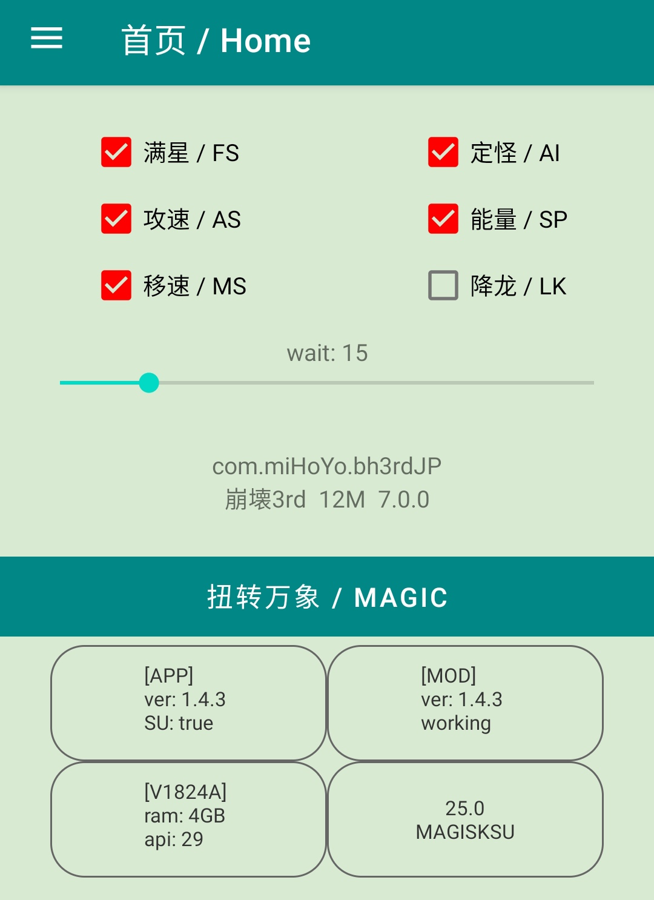

# [EN VER](README_en.md)  
  

# 崩坏3
* 游戏区服：不限制
* 游戏版本：不限制
* 设备环境：安卓真机，模拟器不支持
* 安卓版本：安卓9以上
* Root：是

# 特点
* 动态抓取offset，无需担心游戏版本区服没适配
* 完全免费，APP无服务器
* 非常安全，不易被检测封号
* 适配arm64-v8a架构
* 支持游戏分包模式 (apks)

# 功能
* 满星
* 定怪
* 攻速：2x
* 能量：获取效率 2x
* 移速：2x
* 超伤（危险）

# 食用
* 手机解锁BL并接管超级权限
* 开启Zygisk
* 安装打开URC，跟着toast做就行了

# 注意
* 你需要手动绕过游戏自身可能存在的SU检测
* Shamiko模块提供绕过SU检测，官版面具建议刷入
* 如果SU环境不是由面具提供，那默认你有一定的玩机基础，需手动刷入JMBQ模块，其余问题自行解决
* 面具用户不知道怎么用的，可以来这里看教程（流程大体相同）https://mega.nz/folder/spFFgSia#dd5jeZHyADqZ5a1lEj3xgw
* 若觉得面具经常弹权限toast碍眼，可以去面具的"超级权限"里关闭URC的“超级用户通知”

