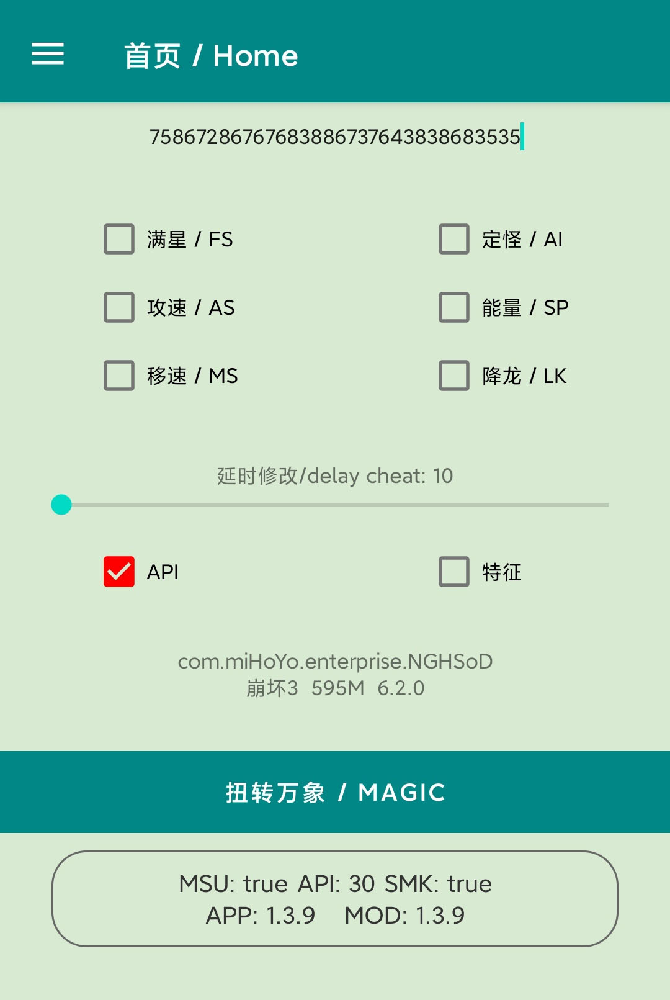

# For Honkai Impact 3
* Game server： Unlimited
* Game version:  Unlimited
* device : Android mobile

# Software features
* Automatically resolve the target address to achieve the effect
* Completely free, the software itself does not have any server
* High security, not easy to be detected and blocked

# Installation requirements
* Mobile unlock bl
* take over SU

# Attach Chinese-English comparison
* If the URC home page shows that the size of the target installation package is less than 200m, it may not take effect. You need to go to the official website to download and install the complete package (greater than 200m), and 141 will add relevant prompts
* 满星  ->  full star, or three star, safe
* AI    ->  Delete monster AI, safe, but don't use in the Online combat with other player
* 攻速  ->  You will have twice the attack speed, No risk for daily use，Other scenarios are not tested
* SP    ->  You will have twice the SP, Multiplier detection has been bypassed，No risk for Main line use，Other scenarios are not tested
