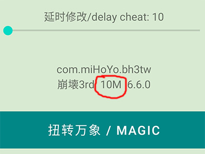

# Honkai Impact 3
* Game server： Unlimited
* Game version:  Unlimited
* device : Android phone
* Root:  Yes

# Software features
* Automatically resolve the target address to achieve the effect
* Completely free, the software itself does not have any server
* High security, not easy to be detected and blocked

# How to use
* phone unlock bootloader
* take over SU
* open the Zygisk

# Note
* FS  ->  full star, or three star, safe
* AI  ->  Delete monster AI, safe, but don't use in the Online combat with other player
* AS  ->  Attack speed increase
* SP  ->  SP acquisition boost
* MS  ->  Movement speed increase
* LK  ->  super damage, Dangers
  
* If the URC home page shows that the size of the target installation package is less than 200m, it may not take effect. You need to go to the honkaiimpact3.hoyoverse.com to download and install the complete package (greater than 200m), and 141 will add relevant prompts  

